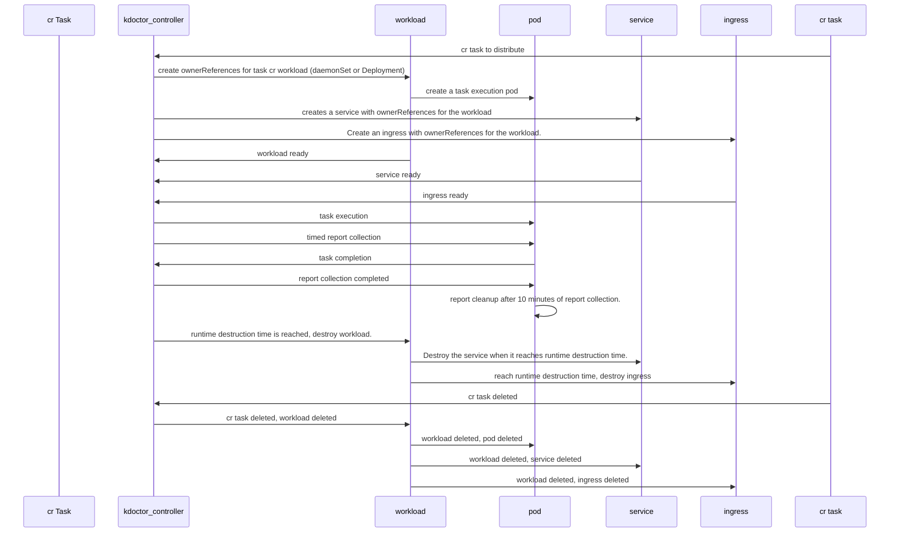

## Runtime

[**简体中文**](./runtime-zh_CN.md) | **English**

After deploying kdoctor, a default task carrier (Daemonset) will be created. When a task CR is issued, kdoctor-controller will choose to generate the corresponding task carrier (DaemonSet or Deployment) or use the default carrier resources based on whether or not the AgentSpec field is defined in the CR. When all Pods are ready, they start executing tasks according to the task definitions in the Spec.

### Carrier resources

When a task CR is issued, kdoctor-controller creates or reuses the following resources for the task.

### Workloads

1. Default workload
    > The default workload (DaemonSet) is generated after kdoctor is deployed and is used for tasks when no AgentSpec is defined; this carrier is not deleted for task deletion or termination.

    > Since all tasks that use the default workload will be executed in this load, it is suitable for tasks with fewer requests and less resource usage.  

2. New workload
    > The workload is DaemonSet or Deployment, the default is DaemonSet, each Pod in the load makes the request according to the task configuration and drops the execution result to the Pod, which can be set in AgentSpec.
    > Destruction time of the workload, by default, the workload will be destroyed after 60 minutes of task execution, when the CR task is deleted, the workload will be deleted together.

    When the CR task is deleted, the workload will be deleted as well. > This workload executes a task alone, so it is isolated from the resource usage of other tasks, which is suitable for tasks with a large number of requests and resource consumption. 

### Service

1. Default workload Service
    > Same as the default workload, it is generated after deploying kdoctor, associated with the default workload, and will not be deleted when a task is deleted or terminated.
2. new workload Service
    >When creating a workload, kdoctor-controller will create a corresponding service and bind it to the pod of the workload according to the IP Family configuration. This is used to test the service network connectivity. Same logic as workload
    > destruction logic.

### Ingress

1. default workload Ingress
   >is generated after deployment of the kdoctor and is associated with the default workload service and will not be deleted when the task is deleted or terminated, as is the case with the default workload.
2. new workload Ingress
   >When the task is NetReach, if the test target contains an Ingress, an Ingress is created to test the network connectivity of the Ingress, with the same destruction logic as the workload.

### Report Collection

When the task CR is issued, kdoctor-controller will register the task into ReportManager, which will periodically go to each task load to get the report via GRPC interface and aggregate the reports into the kdoctor-controller.
In kdoctor-controller, after aggregation, you can get the report result by command `kubectl get kdoctorreport`, therefore, if you delete the workload before the report is collected, it will affect the report aggregation result.

### Lifecycle

* After a task is started, kdoctor-controller collects reports from the pods in the task at regular intervals, and after the task is completed, report collection is complete and no further report collection will be performed.
* After the task load finishes executing the task, the reports are collected by kdoctor-controller reports are automatically cleaned out of the load after 10 minutes by default.
* When a completed task CR is deleted, the report still exists in the kdoctor-controller report directory, but it cannot be viewed through the k8s aggregation api and needs to be viewed manually.
* When deleting an executing task CR, the task will be terminated, the resources generated during the creation of the CR will be deleted, and the collected reports will still be stored in the kdoctor-controller report catalog.
